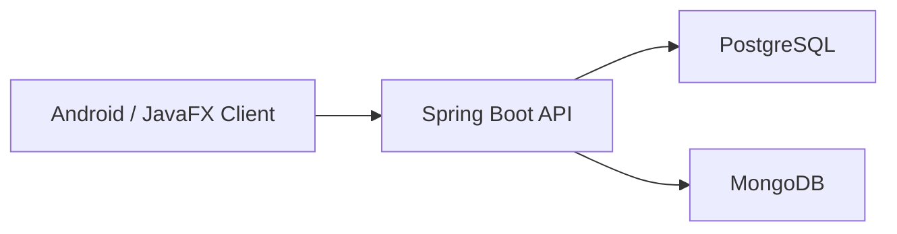

# PetCare-Tracer

Evcil hayvan sahiplerinin; saglik, asi, ilac, beslenme, randevu, hatirlatma ve aktivite verilerini tek merkezden yonetebildigi ileri Java dersi projesi.

## Proje Yapisi

- `backend/petcare-backend`
  Spring Boot + JDBC + MongoDB backend
- `admin-panel/petcare-admin`
  JavaFX admin panel
- `db`
  PostgreSQL schema ve seed scriptleri
- `docs`
  kurulum ve performans test dokumani
- `tests/k6`
  performans testi scriptleri
- `mobil-app`
  Android istemci icin ayrilan alan
  Login, register, dashboard ve pet listeleme iskeleti hazir

## Kullanilan Teknolojiler

- Java 17
- Spring Boot
- Spring JDBC
- PostgreSQL
- MongoDB
- BCrypt
- Docker Compose
- k6
- JavaFX
- Prometheus
- Grafana

## Tamamlanan Backend Modulleri

- auth
- users
- pets
- health records
- vaccines
- vaccine records
- medications
- medication schedules
- feeding plans
- appointments
- reminders
- activity logs

## Yerel Calistirma

1. PostgreSQL ve MongoDB servislerini ac.
2. `petcare_tracker` veritabanini `db/01_schema.sql` ve `db/02_seed.sql` ile hazirla.
3. Backend klasorune gir:

```bash
cd backend/petcare-backend
```

4. Uygulamayi baslat:

```bash
mvnw.cmd spring-boot:run
```

## Docker Ile Calistirma

Kok klasorde:

```bash
docker compose up --build
```

Bu kurulum su servisleri ayaga kaldirir:

- PostgreSQL: `localhost:5433`
- MongoDB: `localhost:27018`
- Backend API: `http://localhost:8080`
- Prometheus: `http://localhost:9090`
- Grafana: `http://localhost:3000`

## Temel Testler

Hazir HTTP istekleri:

- [requests.http](/C:/Users/MSI/Desktop/PetCare-Tracer/backend/petcare-backend/requests.http)

Performans testleri:

```bash
k6 run tests/k6/smoke-test.js
k6 run tests/k6/core-load.js
```

Monitoring notlari:

- [observability.md](/C:/Users/MSI/Desktop/PetCare-Tracer/docs/observability.md)

## JavaFX Admin Panel

```bash
backend/petcare-backend/mvnw.cmd -f admin-panel/petcare-admin/pom.xml javafx:run
```

Detayli notlar:

- [javafx-admin-panel.md](/C:/Users/MSI/Desktop/PetCare-Tracer/docs/javafx-admin-panel.md)

## Android Mobile

Android Studio ile acilacak proje:

- `mobil-app/PetCareMobile`

Detayli notlar:

- [android-mobile.md](/C:/Users/MSI/Desktop/PetCare-Tracer/docs/android-mobile.md)
- [screenshots-guide.md](/C:/Users/MSI/Desktop/PetCare-Tracer/docs/screenshots-guide.md)

## Mimari Ozeti



## Ekran Goruntuleri

- Giris ekrani: ekran goruntusu
- Kayit ekrani: ekran goruntusu
- Dashboard: ekran goruntusu
- Pet listesi: ekran goruntusu
- JavaFX admin panel: ekran goruntusu
- Prometheus target ekrani: ekran goruntusu
- Grafana dashboard: ekran goruntusu

## Sonraki Asama

- Android pet detay, saglik ve hatirlatma ekranlari
- ekran goruntuleri ve sunum raporu
