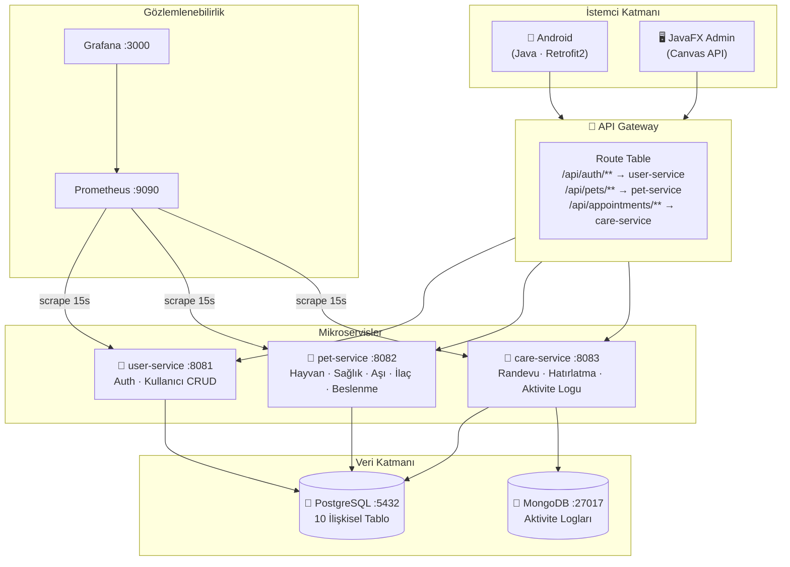
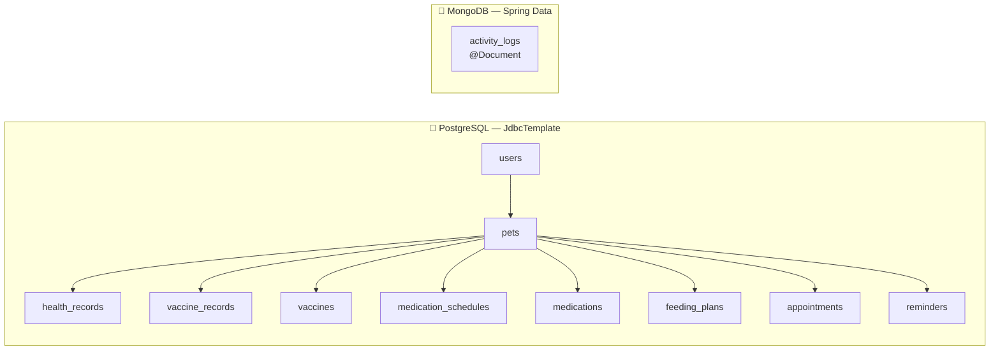
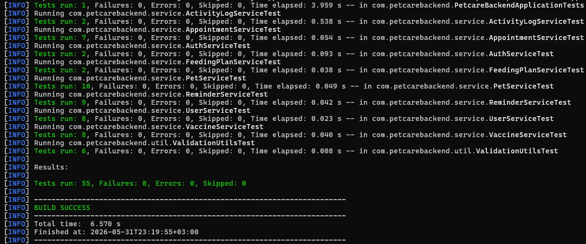

# 🐾 PetCare-Tracer

<div align="center">

> **TBL324 İleri Java Uygulamaları**
> Evcil hayvan sağlık, aşı, ilaç, beslenme, randevu ve aktivite verilerini tek merkezden yöneten **çok katmanlı mikroservis Java platformu.**

[](https://openjdk.org/projects/jdk/17/)
[](https://spring.io/projects/spring-boot)
[](https://spring.io/projects/spring-cloud-gateway)
[](https://www.postgresql.org/)
[](https://www.mongodb.com/)
[](https://docs.docker.com/compose/)
[](https://developer.android.com/)
[](https://k6.io/)

#### PetCare-Tracer, evcil hayvan sahiplerinin saglik, asi, ilac, beslenme, randevu, hatirlatma ve aktivite verilerini tek bir merkezden yonetebilmesi icin gelistirilmis cok katmanli bir takip platformudur. Proje, Ileri Java dersi kapsaminda Java tabanli backend, JavaFX admin paneli, Android istemci ve izleme/test altyapisi ile tasarlanmistir.

</div>

     🏗️ Sistem Mimarisi

### Mikroservis Yapısı



### Veritabanı Şeması



---

## 🚀 Hızlı Başlangıç

### 1. Sistemi Başlat

```bash
# Tüm mikroservisleri + altyapıyı başlat
docker compose up --build
```

> ⏱️ **İlk build ~10-15 dakika** sürebilir — 4 ayrı Maven build yapılır.

### 2. Erişim Noktaları

| Servis | URL | Bilgi |
|--------|-----|-------|
| 🔀 **API Gateway** | http://localhost:8080 | Tüm isteklerin giriş noktası |
| 🔍 **Sağlık Kontrolü** | http://localhost:8080/actuator/health | `{"status":"UP"}` |
| 📊 **Prometheus** | http://localhost:9090 | Metrik toplama |
| 📈 **Grafana** | http://localhost:3000 | `admin` / `admin123` |
| 👤 user-service | http://localhost:8081 | (iç — doğrudan erişim) |
| 🐾 pet-service | http://localhost:8082 | (iç — doğrudan erişim) |
| 📅 care-service | http://localhost:8083 | (iç — doğrudan erişim) |

### 3. Test Kullanıcısı

```
E-posta : ahmet@example.com
Şifre   : test123
```

---

## 📁 Proje Yapısı

```
PetCare-Tracer/
│
├── microservices/                      ← YENİ — Mikroservis Mimarisi
│   ├── gateway/                        ← Spring Cloud Gateway (:8080)
│   ├── user-service/                   ← Auth + Kullanıcı (:8081)
│   ├── pet-service/                    ← Hayvan CRUD (:8082)
│   └── care-service/                   ← Randevu + Hatırlatma + Aktivite (:8083)
│
├── backend/petcare-backend/            ← Monolitik referans backend (Java 17)
│   └── src/main/java/com/petcarebackend/
│       ├── controller/                 ← 13 REST Controller
│       ├── service/                    ← CrudService<T>, I*Service
│       ├── repository/                 ← JdbcTemplate + MongoRepository
│       ├── model/                      ← Java Records
│       ├── dto/                        ← Request / Response DTO'ları
│       ├── exception/                  ← GlobalExceptionHandler
│       └── util/                       ← ValidationUtils (DRY)
│
├── admin-panel/petcare-admin/          ← JavaFX Admin Paneli
│   └── ui/StatusBadgeCell.java        ← Canvas + GraphicsContext custom grafik
│
├── mobil-app/PetCareMobile/            ← Android Uygulaması (Java)
│   └── ui/
│       ├── LoginActivity.java
│       ├── RegisterActivity.java
│       ├── DashboardActivity.java      ← Pet sayısı istatistiği
│       ├── PetListActivity.java        ← RecyclerView + SwipeRefresh + FAB
│       ├── PetDetailActivity.java      ← Randevu ekleme + silme
│       └── AddPetActivity.java         ← DatePicker + Spinner + validasyon
│
├── db/
│   ├── 01_schema.sql                   ← PostgreSQL şema (10 tablo)
│   └── 02_seed.sql                     ← Örnek veriler
│
├── monitoring/
│   ├── prometheus/prometheus.yml       ← 4 servis scrape config
│   └── grafana/provisioning/           ← Otomatik dashboard provisioning
│
├── tests/k6/
│   ├── smoke-test.js                   ← Sağlık kontrolü (1 VU, 30s)
│   ├── core-load.js                    ← Yük testi (5→15 VU, 80s)
│   └── stress-test.js                  ← Kırılma noktası (10→150 VU, 3dk)
│
├── docs/
│   ├── technical-report.md
│   ├── performance-testing.md
│   ├── microservices.md                ← Mikroservis mimari dokümantasyonu
│   ├── observability.md
│   └── database-setup.md
│
└── docker-compose.yml                  ← 9 container tanımı
```

---

## 🔬 Kriter Detayları

### 1. Mikroservis Mimarisi + API Gateway

#### Route Tablosu

| İstek Yolu | Hedef Servis | Port |
|-----------|-------------|:----:|
| `/api/auth/**`, `/api/users/**` | user-service | 8081 |
| `/api/pets/**`, `/api/health-records/**`, `/api/vaccines/**`, `/api/medications/**`, `/api/feeding-plans/**` | pet-service | 8082 |
| `/api/appointments/**`, `/api/reminders/**`, `/api/activity-logs/**` | care-service | 8083 |

```yaml
# gateway/application.yml — Spring Cloud Gateway konfigürasyonu
spring:
  cloud:
    gateway:
      routes:
        - id: user-service
          uri: http://user-service:8081
          predicates: [Path=/api/auth/**, /api/users/**]
          filters: [AddRequestHeader=X-Gateway-Source, petcare-gateway]
        - id: pet-service
          uri: http://pet-service:8082
          predicates: [Path=/api/pets/**, /api/health-records/**, ...]
        - id: care-service
          uri: http://care-service:8083
          predicates: [Path=/api/appointments/**, /api/reminders/**, ...]
```

---

### 2. API & Back-end

Spring Boot 3.5 ile geliştirilmiş RESTful API. Tüm endpoint'ler `ApiResponse<T>` sarmalayıcısıyla standart yanıt döndürür.

| Endpoint | Metotlar | Açıklama |
|----------|----------|----------|
| `/api/auth` | POST login, register | Kimlik doğrulama |
| `/api/users` | GET, PUT, DELETE | Kullanıcı yönetimi |
| `/api/pets` | GET, POST, PUT, DELETE | Evcil hayvan CRUD |
| `/api/health-records` | GET, POST, DELETE | Sağlık kayıtları |
| `/api/vaccines` | GET, POST | Aşı kataloğu |
| `/api/vaccine-records` | GET, POST, DELETE | Aşı uygulama kayıtları |
| `/api/medications` | GET, POST | İlaç kataloğu |
| `/api/medication-schedules` | GET, POST, DELETE | İlaç takvimi |
| `/api/feeding-plans` | GET, POST, DELETE | Beslenme planları |
| `/api/appointments` | GET, POST, DELETE | Randevular |
| `/api/reminders` | GET, POST, DELETE | Hatırlatmalar |
| `/api/activity-logs` | GET, POST | Aktivite logları (MongoDB) |
| `/actuator/health`, `/actuator/prometheus` | GET | Gözlemlenebilirlik |

---

### 3. Generic Yapılar

```java
// CrudService<Res, ID, CreateReq> — tip güvenli generic arayüz
public interface CrudService<Res, ID, CreateReq> {
    List<Res> findAll();
    Res findById(ID id);
    Res create(CreateReq request);
    void delete(ID id);
}

// ApiResponse<T> — generic sarmalayıcı
public record ApiResponse<T>(boolean success, String message, T data) {
    public static <T> ApiResponse<T> success(String msg, T data) { ... }
    public static <T> ApiResponse<T> failure(String message) { ... }
}

// StatusBadgeCell<T> — JavaFX generic TableCell
public class StatusBadgeCell<T> extends TableCell<T, String> {
    // Canvas + GraphicsContext ile özel grafik çizimi
}
```

---

### 4. Custom GUI

#### JavaFX Admin Panel — Canvas Custom Graphics

```java
// StatusBadgeCell<T> — standart bileşen değil, Canvas ile özel çizim
private void drawBadge(String status) {
    GraphicsContext gc = canvas.getGraphicsContext2D();
    gc.setFill(resolveBgColor(status));
    gc.fillRoundRect(0, 0, BADGE_WIDTH, BADGE_HEIGHT, 26, 26);  // yuvarlak badge
    gc.setFont(Font.font("System", FontWeight.BOLD, 11.5));
    gc.setTextAlign(TextAlignment.CENTER);
    gc.setTextBaseline(VPos.CENTER);
    gc.fillText(status, BADGE_WIDTH / 2.0, BADGE_HEIGHT / 2.0);
}
```

#### Android Mobil Uygulama

| Ekran | Sınıf | Özellik |
|-------|-------|---------|
| Giriş | `LoginActivity` | Retrofit2, session yönetimi |
| Kayıt | `RegisterActivity` | Form validasyonu |
| Dashboard | `DashboardActivity` | Pet sayısı istatistiği, API'den dinamik |
| Pet Listesi | `PetListActivity` | RecyclerView + SwipeRefresh + FAB |
| Pet Detayı | `PetDetailActivity` | Randevu listesi, randevu ekleme, silme |
| Hayvan Ekle | `AddPetActivity` | DatePickerDialog, Spinner, form validasyonu |

---

### 5. JDBC & NoSQL

- **PostgreSQL + JdbcTemplate:** 10 ilişkisel tablo, FK bütünlüğü, ACID garantisi
- **MongoDB + Spring Data MongoRepository:** `ActivityLog` dökümanları, şemasız esnek yapı

```java
// PostgreSQL — JdbcTemplate (user-service, pet-service, care-service)
return jdbc.query("SELECT * FROM pets WHERE user_id=?", this::mapRow, userId);

// MongoDB — MongoRepository (care-service)
public interface ActivityLogRepository extends MongoRepository<ActivityLog, String> {
    List<ActivityLog> findByPetId(Long petId);
}
```

---

### 6. SOLID & OOP

| Prensip | Uygulama | Dosya |
|---------|----------|-------|
| **S** — Single Responsibility | Her servis tek varlık yönetir | `PetService`, `UserService`... |
| **O** — Open/Closed | `CrudService<T>` değişmeden genişletilebilir | `CrudService.java` |
| **L** — Liskov Substitution | `PetServiceImpl implements IPetService` | `IPetService.java` |
| **I** — Interface Segregation | CRUD + domain özel metotlar ayrı | `IPetService`, `IUserService`... |
| **D** — Dependency Inversion | Controller → Interface | `PetController → IPetService` |
| **DRY** | Ortak validasyon tek yerde | `ValidationUtils.java` |

---

### 7. Hata Yönetimi

```java
@RestControllerAdvice
public class GlobalExceptionHandler {
    @ExceptionHandler(NotFoundException.class)    // → HTTP 404
    @ExceptionHandler(BadRequestException.class)  // → HTTP 400
    @ExceptionHandler(DataAccessException.class)  // → HTTP 500
    @ExceptionHandler(Exception.class)            // → HTTP 500 (fallback)
}
```

Tüm hatalar `ApiResponse.failure(message)` formatında döner:
```json
{ "success": false, "message": "Pet not found: 99", "data": null }
```

---

### 8. Performans Testleri

k6 ile 3 seviyeli performans testi uygulanmıştır. Testler `tests/k6/` dizininde bulunur.

#### Test Seviyeleri

| Test | Dosya | VU Profili | Süre | Eşikler |
|------|-------|-----------|------|---------|
| 🟢 **Smoke** | `smoke-test.js` | 1 VU sabit | ~30s | hata < %1 · p95 < 1500ms |
| 🟡 **Load** | `core-load.js` | 5 → 15 → 0 VU | ~80s | hata < %2 · p95 < 2000ms |
| 🔴 **Stress** | `stress-test.js` | 10 → 150 → 0 VU | ~3dk | hata < %10 · p95 < 3000ms |

#### Çalıştırma Komutları

```bash
# Önce Docker'ı başlat
docker compose up --build

# Ayrı bir terminalde testleri çalıştır
k6 run tests/k6/smoke-test.js    # ~30 saniye
k6 run tests/k6/core-load.js     # ~80 saniye
k6 run tests/k6/stress-test.js   # ~3 dakika
```

#### Test Sonuçları

> 📸 **Smoke Test Sonucu**
>
>


---

> 📸 **Load Test Sonucu**
>
>


---

> 📸 **Stress Test Sonucu**
>
>


---

> 📸 **Grafana Dashboard — Yük Altında**
>
>

---

### 9. TDD — Test Driven Development

**55 Test, 9 Sınıf:**

| Test Sınıfı | Test Sayısı |
|-------------|:-----------:|
| `PetServiceTest` | 9 |
| `VaccineServiceTest` | 8 |
| `ReminderServiceTest` | 9 |
| `UserServiceTest` | 7 |
| `AppointmentServiceTest` | 7 |
| `ValidationUtilsTest` | 6 |
| `ActivityLogServiceTest` | 2 |
| `FeedingPlanServiceTest` | 2 |
| `AuthServiceTest` | 2 |
| **TOPLAM** | **52** |

```bash
cd backend/petcare-backend
.\mvnw.cmd test
# Beklenen: Tests run: 55, Failures: 0, Errors: 0, Skipped: 0
```

> 📸 **JUnit Test Sonucu**
>
> 
>

---

### 10. Dockerize Sistem

```yaml
# docker-compose.yml — 9 container, tek komut
services:
  postgres:       # healthcheck'li PostgreSQL 17
  mongo:          # healthcheck'li MongoDB 8
  user-service:   # Spring Boot :8081 (postgres hazır olunca)
  pet-service:    # Spring Boot :8082 (postgres hazır olunca)
  care-service:   # Spring Boot :8083 (postgres + mongo hazır olunca)
  gateway:        # Spring Cloud Gateway :8080 (tüm servisler hazır olunca)
  prometheus:     # Micrometer metrik toplama
  grafana:        # Dashboard (provisioning otomatik)
  k6:             # Yük testi container'ı (--profile loadtest)
```

```bash
# Sistemi başlat
docker compose up --build

# Çalışan container'ları görüntüle
docker compose ps

# Yük testini Docker ile çalıştır (k6 yüklü değilse)
docker compose --profile loadtest run --rm k6 run /scripts/stress-test.js
```

---

## 🧪 Çalıştırma Rehberi

### JUnit Testleri

```bash
cd backend/petcare-backend
.\mvnw.cmd test
```

### k6 Performans Testleri

```bash
# Docker ayakta olmalı
k6 run tests/k6/smoke-test.js     # Smoke  — 1 VU,  ~30s
k6 run tests/k6/core-load.js      # Load   — 15 VU, ~80s
k6 run tests/k6/stress-test.js    # Stress — 150 VU, ~3dk
```

### JavaFX Admin Paneli

```bash
.\admin-panel\petcare-admin\mvnw.cmd -f admin-panel\petcare-admin\pom.xml javafx:run
```

### Android Uygulaması

```
1. Android Studio → mobil-app/PetCareMobile
2. Emülatör başlat
3. API URL: http://10.0.2.2:8080  (emülatör → localhost Gateway)
4. Giriş: ahmet@example.com / test123
```

---

## 📊 Gözlemlenebilirlik

| Araç | URL | Amaç |
|------|-----|------|
| Prometheus | http://localhost:9090 | Metrik toplama (15s scrape) |
| Grafana | http://localhost:3000 | HTTP istek oranı, p95 latency, JVM heap |
| Gateway Health | http://localhost:8080/actuator/health | Gateway sağlık |
| User Health | http://localhost:8081/actuator/health | user-service sağlık |
| Pet Health | http://localhost:8082/actuator/health | pet-service sağlık |
| Care Health | http://localhost:8083/actuator/health | care-service sağlık |
| Prometheus Metrics | http://localhost:8081/actuator/prometheus | Ham Micrometer metrikleri |

---

## 🛠️ Teknoloji Yığını

| Katman | Teknoloji |
|--------|-----------|
| **Mikroservis Backend** | Java 17 · Spring Boot 3.5 · Spring Cloud Gateway 2024.0 |
| **Veritabanı** | PostgreSQL 17 (JdbcTemplate) · MongoDB 8 (Spring Data) |
| **Admin GUI** | JavaFX 21 · Canvas API · GraphicsContext |
| **Mobil** | Android (Java) · Retrofit2 · Material Design 3 |
| **Altyapı** | Docker · Docker Compose · Maven Wrapper |
| **İzleme** | Prometheus · Grafana · Micrometer |
| **Test** | JUnit 5 · Mockito · k6 |
| **Güvenlik** | BCrypt (Spring Security) |

---

## 📚 Dokümantasyon

| Doküman | İçerik |
|---------|--------|
| [docs/technical-report.md](docs/technical-report.md) | Mermaid diyagramları ile teknik rapor |
| [docs/microservices.md](docs/microservices.md) | Mikroservis mimarisi — route tablosu, servis detayları |
| [docs/performance-testing.md](docs/performance-testing.md) | k6 test sonuçları ve analiz |
| [docs/observability.md](docs/observability.md) | Prometheus + Grafana kurulumu |
| [docs/database-setup.md](docs/database-setup.md) | Veritabanı şema açıklaması |
