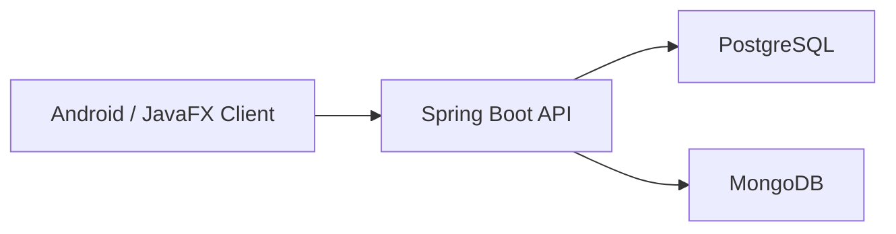

# PetCare-Tracer

Evcil hayvan sahiplerinin; saglik, asi, ilac, beslenme, randevu, hatirlatma ve aktivite verilerini tek merkezden yonetebildigi ileri Java dersi projesi.

## Proje Yapisi

- `backend/petcare-backend`
  Spring Boot + JDBC + MongoDB backend
- `db`
  PostgreSQL schema ve seed scriptleri
- `docs`
  kurulum ve performans test dokumani
- `tests/k6`
  performans testi scriptleri
- `mobil-app`
  Android istemci icin ayrilan alan

## Kullanilan Teknolojiler

- Java 17
- Spring Boot
- Spring JDBC
- PostgreSQL
- MongoDB
- BCrypt
- Docker Compose
- k6

## Tamamlanan Backend Modulleri

- auth
- users
- pets
- health records
- vaccines
- vaccine records
- medications
- medication schedules
- feeding plans
- appointments
- reminders
- activity logs

## Yerel Calistirma

1. PostgreSQL ve MongoDB servislerini ac.
2. `petcare_tracker` veritabanini `db/01_schema.sql` ve `db/02_seed.sql` ile hazirla.
3. Backend klasorune gir:

```bash
cd backend/petcare-backend
```

4. Uygulamayi baslat:

```bash
mvnw.cmd spring-boot:run
```

## Docker Ile Calistirma

Kok klasorde:

```bash
docker compose up --build
```

Bu kurulum su servisleri ayaga kaldirir:

- PostgreSQL: `localhost:5433`
- MongoDB: `localhost:27018`
- Backend API: `http://localhost:8080`

## Temel Testler

Hazir HTTP istekleri:

- [requests.http](/C:/Users/MSI/Desktop/PetCare-Tracer/backend/petcare-backend/requests.http)

Performans testleri:

```bash
k6 run tests/k6/smoke-test.js
k6 run tests/k6/core-load.js
```

## Mimari Ozeti



## Sonraki Asama

- JavaFX admin panel
- Android login ve dashboard entegrasyonu
- ekran goruntuleri ve sunum raporu
