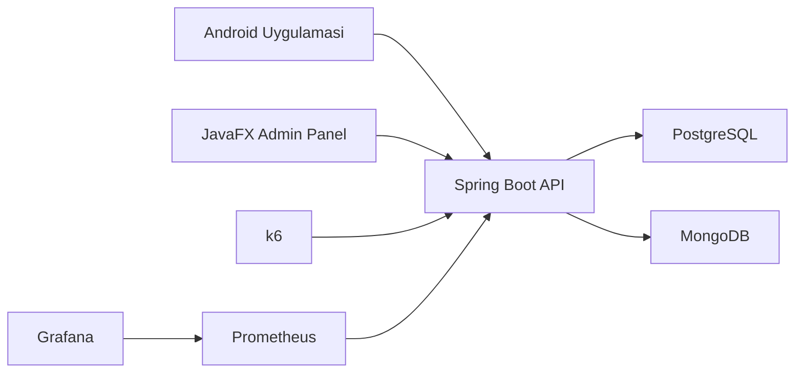

# PetCare-Tracer

PetCare-Tracer, evcil hayvan sahiplerinin saglik, asi, ilac, beslenme, randevu, hatirlatma ve aktivite verilerini tek bir merkezden yonetebilmesi icin gelistirilmis cok katmanli bir takip platformudur. Proje, Ileri Java dersi kapsaminda Java tabanli backend, JavaFX admin paneli, Android istemci ve izleme/test altyapisi ile tasarlanmistir.

## Proje Amaci

Bu projenin amaci, evcil hayvan sahiplerinin daginik halde tuttugu bilgileri tek bir dijital platformda toplamak ve asagidaki ihtiyaclari karsilamaktir:

- evcil hayvan profili olusturma
- saglik gecmisi tutma
- asi kayitlarini takip etme
- ilac ve doz planlarini yonetme
- beslenme planlarini kaydetme
- veteriner randevularini saklama
- hatirlatma olusturma
- gunluk aktivite kayitlarini izleme

## Kullanilan Teknolojiler

- Java 17
- Spring Boot
- Spring JDBC
- PostgreSQL
- MongoDB
- BCrypt
- JavaFX
- Android Studio (Java)
- Docker Compose
- Prometheus
- Grafana
- k6
- JUnit + Mockito

## Sistem Mimarisi



## Tamamlanan Moduller

### Backend

- Auth
- Users
- Pets
- Health Records
- Vaccines
- Vaccine Records
- Medications
- Medication Schedules
- Feeding Plans
- Appointments
- Reminders
- Activity Logs

### Istemci Tarafi

- JavaFX admin panel iskeleti
- Android login ekrani
- Android register ekrani
- Android dashboard ekrani
- Android pet listesi ekrani

### DevOps / Test

- Docker Compose kurulumu
- Prometheus metrics toplama
- Grafana dashboard
- k6 smoke test
- k6 hafif yuk testi
- temel TDD tabanli service testleri

## Proje Klasor Yapisi

- `backend/petcare-backend`
  Spring Boot backend kodlari
- `admin-panel/petcare-admin`
  JavaFX admin panel projesi
- `mobil-app/PetCareMobile`
  Android Studio mobil istemci projesi
- `db`
  PostgreSQL schema ve seed scriptleri
- `monitoring`
  Prometheus ve Grafana konfigrasyonlari
- `tests/k6`
  performans test scriptleri
- `docs`
  kurulum ve kullanim dokumanlari

## Yerel Calistirma

### Backend

```bash
cd backend/petcare-backend
mvnw.cmd spring-boot:run
```

Varsayilan backend adresi:

- `http://localhost:8080`

### Docker ile Tum Sistemi Calistirma

```bash
docker compose up --build
```

Bu komut asagidaki servisleri ayaga kaldirir:

- PostgreSQL: `localhost:5433`
- MongoDB: `localhost:27018`
- Backend API: `http://localhost:8080`
- Prometheus: `http://localhost:9090`
- Grafana: `http://localhost:3000`

Grafana giris bilgileri:

- kullanici: `admin`
- sifre: `admin123`

## Test ve Izleme

### HTTP Istekleri

- [requests.http](/C:/Users/MSI/Desktop/PetCare-Tracer/backend/petcare-backend/requests.http)

### k6 Testleri

```bash
k6 run tests/k6/smoke-test.js
k6 run tests/k6/core-load.js
```

Docker profili ile:

```bash
docker compose --profile loadtest run --rm k6 run /scripts/smoke-test.js
```

### TDD / Unit Test

Backend testleri:

```bash
cd backend/petcare-backend
mvnw.cmd test
```

Eklenen ornek test siniflari:

- `AuthServiceTest`
- `ActivityLogServiceTest`
- `FeedingPlanServiceTest`

## Android Notlari

Android Studio'da acilacak proje:

- `mobil-app/PetCareMobile`

Android emulator icin backend adresi:

- `http://10.0.2.2:8080/`

Onemli not:

- `No target device found` hatasi koddan degil, emulator veya fiziksel cihaz tanimli olmamasindan kaynaklanir.
- Bu durumda Android Studio icinde `Tools > Device Manager > Create Device` adimlariyla bir emulator olusturulmalidir.

Detayli rehber:

- [android-mobile.md](/C:/Users/MSI/Desktop/PetCare-Tracer/docs/android-mobile.md)

## JavaFX Admin Panel

Calistirma:

```bash
backend/petcare-backend/mvnw.cmd -f admin-panel/petcare-admin/pom.xml javafx:run
```

Detayli not:

- [javafx-admin-panel.md](/C:/Users/MSI/Desktop/PetCare-Tracer/docs/javafx-admin-panel.md)

## Dokumantasyon

- [database-setup.md](/C:/Users/MSI/Desktop/PetCare-Tracer/docs/database-setup.md)
- [performance-testing.md](/C:/Users/MSI/Desktop/PetCare-Tracer/docs/performance-testing.md)
- [observability.md](/C:/Users/MSI/Desktop/PetCare-Tracer/docs/observability.md)
- [screenshots-guide.md](/C:/Users/MSI/Desktop/PetCare-Tracer/docs/screenshots-guide.md)

## Ekran Goruntuleri

Asagidaki ekran goruntulerinin README veya rapora eklenmesi onerilir:

- Giris ekrani
- Kayit ekrani
- Dashboard
- Pet listesi
- JavaFX admin panel
- Prometheus targets
- Grafana dashboard

Ekran goruntulerini su klasorde toplayabilirsin:

- `docs/screenshots`

## Mevcut Durum

Proje genel olarak teslime yakin bir seviyededir. Backend tarafi buyuk oranda tamamlanmistir. Kalan ana gelistirmeler mobil tarafta pet detay, saglik kayitlari ve hatirlatma ekranlarinin zenginlestirilmesi ile sunum/rapor son duzenlemeleridir.

## Not

Bu README proje teslimi icin hazirlandi. Grup bilgileri ve ekran goruntuleri eklendikten sonra dogrudan rapor veya zip iceriginde kullanilabilir.
