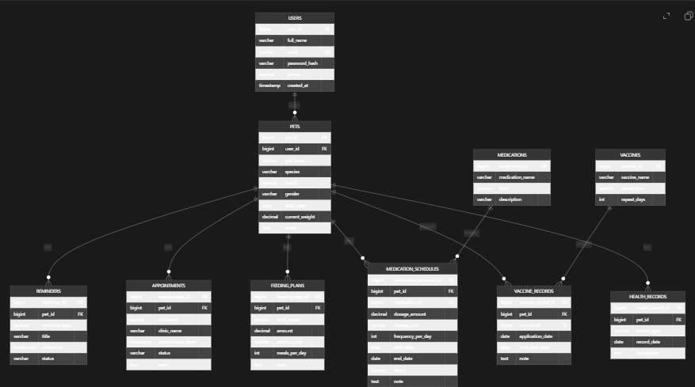

# PetCare Tracker Database Setup

## PostgreSQL fiziksel veri klasoru

Bu bilgisayarda PostgreSQL veri klasoru su an burada:

`C:\Users\MSI\PostgresData17`


Bu klasor, PostgreSQL'in calisan ham veri dosyalarini tutar. Genelde bunu proje klasorune tasimak onerilmez.

## Proje klasorunde ne tutulmali

Proje klasorunde tutulmasi gerekenler:

- `db/01_schema.sql`
- `db/02_seed.sql`
- `backend/application.properties.example`

Yani proje icinde veritabani dosyalari degil, veritabanini olusturan scriptler bulunur.

## Spring Boot baglanti mantigi

Java uygulamasi veritabani dosyalarina dogrudan gitmez. Su sekilde baglanir:

1. PostgreSQL arka planda calisir.
2. Spring Boot `localhost:5432` adresine JDBC ile baglanir.
3. `petcare_tracker` veritabanindaki tablolara sorgu gonderir.

## Ilk baglanti ayarlari

`application.properties` icine su degerler yazilir:

```properties
spring.datasource.url=jdbc:postgresql://localhost:5432/petcare_tracker
spring.datasource.username=postgres
spring.datasource.password=
spring.datasource.driver-class-name=org.postgresql.Driver
```


## Neden veri klasorunu projeye tasimamak daha dogru

- PostgreSQL calisirken bu klasor kilitli olur
- GitHub'a atilmaz
- Boyutu hizla buyur
- Bozulma riski vardir
- Ekip calismasinda tasinabilir degildir

## Projeye alinacak dogru sey

Projeye alinacak sey veritabaninin kendisi degil:

- tablo olusturma scriptleri
- ornek veri scriptleri
- backup dosyalari
- Docker yapisi

## Istersen alternatif

Eger veritabani yapisinin proje klasoruyle birlikte tasinabilir olmasini istiyorsan, en dogru cozum Docker kullanmaktir. O zaman proje icinde `docker-compose.yml` olur ve veritabani servisi proje ile birlikte kalkar.
