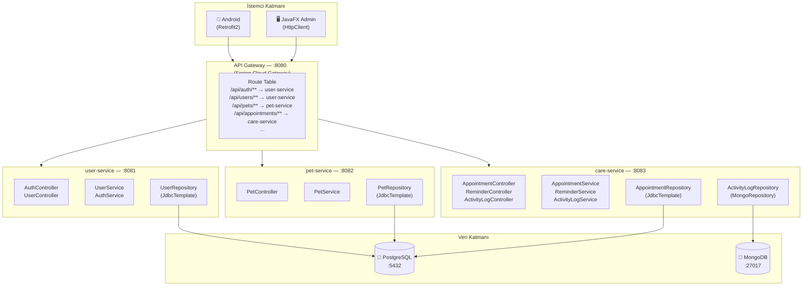

# Mikroservis Mimarisi — Dokümantasyon

> **Mimari:** Spring Cloud Gateway + 3 Spring Boot Mikroservis  
> **Toplam Port:** 8080 (Gateway), 8081 (User), 8082 (Pet), 8083 (Care)

---

## Mimari Diyagramı



---

## Route Tablosu (Gateway)

| İstek Yolu | Hedef Servis | Port |
|-----------|-------------|------|
| `/api/auth/**` | user-service | 8081 |
| `/api/users/**` | user-service | 8081 |
| `/api/pets/**` | pet-service | 8082 |
| `/api/health-records/**` | pet-service | 8082 |
| `/api/vaccines/**` | pet-service | 8082 |
| `/api/vaccine-records/**` | pet-service | 8082 |
| `/api/medications/**` | pet-service | 8082 |
| `/api/medication-schedules/**` | pet-service | 8082 |
| `/api/feeding-plans/**` | pet-service | 8082 |
| `/api/appointments/**` | care-service | 8083 |
| `/api/reminders/**` | care-service | 8083 |
| `/api/activity-logs/**` | care-service | 8083 |

---

## Servis Detayları

### 1. API Gateway (`microservices/gateway/`)

| Özellik | Değer |
|---------|-------|
| Port | 8080 |
| Teknoloji | Spring Cloud Gateway 2024.0.1 |
| Özellikler | Route yönlendirme, CORS, `X-Gateway-Source` header |

**Özellikler:**
- Tek giriş noktası (single entry point) — tüm istemciler yalnızca `:8080`'e bağlanır
- Global CORS yapılandırması
- `AddRequestHeader=X-Gateway-Source, petcare-gateway` filtresi ile kaynak takibi

---

### 2. User Service (`microservices/user-service/`)

| Özellik | Değer |
|---------|-------|
| Port | 8081 |
| Paket | `com.petcare.user` |
| Veritabanı | PostgreSQL (users tablosu) |

**Endpoint'ler:**
```
POST /api/auth/login
POST /api/auth/register
GET  /api/users
GET  /api/users/{id}
PUT  /api/users/{id}
DELETE /api/users/{id}
```

---

### 3. Pet Service (`microservices/pet-service/`)

| Özellik | Değer |
|---------|-------|
| Port | 8082 |
| Paket | `com.petcare.pet` |
| Veritabanı | PostgreSQL (pets tablosu) |

**Endpoint'ler:**
```
GET    /api/pets
GET    /api/pets/{id}
GET    /api/pets/user/{userId}
POST   /api/pets
PUT    /api/pets/{id}
DELETE /api/pets/{id}
```

---

### 4. Care Service (`microservices/care-service/`)

| Özellik | Değer |
|---------|-------|
| Port | 8083 |
| Paket | `com.petcare.care` |
| Veritabanı | PostgreSQL (appointments, reminders) + MongoDB (activity_logs) |

**Endpoint'ler:**
```
GET    /api/appointments
GET    /api/appointments/pet/{petId}
POST   /api/appointments
DELETE /api/appointments/{id}

GET    /api/reminders/pet/{petId}
POST   /api/reminders
DELETE /api/reminders/{id}

GET    /api/activity-logs/pet/{petId}
POST   /api/activity-logs
```

---

## Docker Compose ile Çalıştırma

```bash
# Tüm mikroservisleri başlat (ilk çalıştırma ~5-10 dk sürer — Maven build)
docker compose up --build

# Sadece belirli servisleri yeniden build et
docker compose up --build user-service
docker compose up --build pet-service
docker compose up --build care-service
docker compose up --build gateway
```

**Başlangıç Sırası:**
```
postgres (healthy) ──┐
                     ├──► user-service (healthy) ──┐
mongo    (healthy) ──┤                              ├──► gateway :8080
                     ├──► pet-service (healthy) ───┤
                     └──► care-service (healthy) ───┘
```

---

## Sağlık Kontrolü

```bash
# Gateway üzerinden (tüm istekler buradan geçer)
curl http://localhost:8080/actuator/health

# Her servis ayrı ayrı
curl http://localhost:8081/actuator/health   # user-service
curl http://localhost:8082/actuator/health   # pet-service
curl http://localhost:8083/actuator/health   # care-service
```

---

## Test Örnekleri (Gateway Üzerinden)

```bash
# Login
curl -X POST http://localhost:8080/api/auth/login \
  -H "Content-Type: application/json" \
  -d '{"email":"ahmet@example.com","password":"test123"}'

# Pet listesi
curl http://localhost:8080/api/pets

# Randevu oluştur
curl -X POST http://localhost:8080/api/appointments \
  -H "Content-Type: application/json" \
  -d '{"petId":1,"vetName":"Dr. Smith","appointmentTime":"2026-06-15T10:00:00","status":"PLANNED"}'
```

---

## Proje Yapısı

```
microservices/
├── gateway/                    ← Spring Cloud Gateway
│   ├── pom.xml
│   ├── Dockerfile
│   └── src/main/resources/application.yml
│
├── user-service/               ← Auth + Users
│   ├── pom.xml
│   ├── Dockerfile
│   └── src/main/java/com/petcare/user/
│       ├── controller/         AuthController, UserController
│       ├── service/            AuthService, UserService
│       ├── repository/         UserRepository (JdbcTemplate)
│       ├── model/              User (record)
│       ├── dto/                LoginRequest, LoginResponse, UserResponse...
│       ├── exception/          GlobalExceptionHandler, NotFoundException...
│       └── config/             SecurityConfig (BCrypt)
│
├── pet-service/                ← Pet CRUD
│   ├── pom.xml
│   ├── Dockerfile
│   └── src/main/java/com/petcare/pet/
│       ├── controller/         PetController
│       ├── service/            PetService
│       ├── repository/         PetRepository (JdbcTemplate)
│       ├── model/              Pet (record)
│       ├── dto/                CreatePetRequest, PetResponse, UpdatePetRequest
│       └── exception/          GlobalExceptionHandler...
│
└── care-service/               ← Appointments + Reminders + ActivityLogs
    ├── pom.xml
    ├── Dockerfile
    └── src/main/java/com/petcare/care/
        ├── controller/         AppointmentController, ReminderController, ActivityLogController
        ├── service/            AppointmentService, ReminderService, ActivityLogService
        ├── repository/         AppointmentRepository, ReminderRepository (JDBC)
        │                       ActivityLogRepository (MongoRepository)
        ├── model/              Appointment, Reminder (record), ActivityLog (@Document)
        └── dto/                CreateAppointmentRequest, AppointmentResponse...
```
