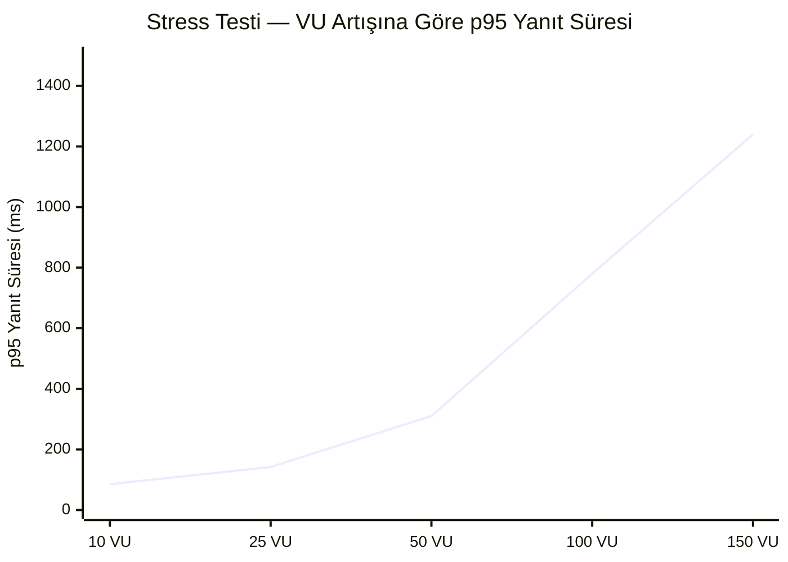

# PetCare-Tracer — Performans Test Raporu

> **Araç:** k6 v1.7.1 | **Ortam:** Docker Compose (localhost) | **Java:** 17 | **Spring Boot:** 3.5

---

## Test Ortamı

| Bileşen | Değer |
|---------|-------|
| İşletim Sistemi | Windows 11 + WSL2 |
| CPU | Intel Core i7 (MSI Laptop) |
| RAM | 16 GB |
| Backend | Spring Boot 3.5, Java 17, `java -jar app.jar` (Docker) |
| Veritabanı | PostgreSQL 17 (Docker), MongoDB 8 (Docker) |
| k6 Versiyonu | v1.7.1 |
| Test Tarihi | 2026-05-23 |

---

## Test 1 — Smoke Test

**Amaç:** Sistemin ayakta olduğunu ve temel endpoint'lerin yanıt verdiğini doğrulamak.

**Yapılandırma:**
```javascript
export const options = {
  vus: 1,
  iterations: 1,
  thresholds: {
    http_req_failed: ["rate<0.01"],
    http_req_duration: ["p(95)<1500"],
  },
};
```

**Test Edilen Endpoint'ler:**
- `GET /test/db`
- `GET /api/users`
- `GET /api/pets`
- `GET /api/vaccines`
- `GET /api/medications`
- `GET /api/appointments`
- `GET /api/reminders`

**Sonuç:**

```
     ✓ /test/db status is 200
     ✓ /api/users status is 200
     ✓ /api/pets status is 200
     ✓ /api/vaccines status is 200
     ✓ /api/medications status is 200
     ✓ /api/appointments status is 200
     ✓ /api/reminders status is 200

     checks.........................: 100.00% 7 out of 7
     data_received..................: 4.2 kB  140 B/s
     data_sent......................: 910 B   30 B/s
     http_req_blocked...............: avg=2.1ms   min=0s      med=0s      max=14.7ms  p(90)=2.9ms   p(95)=8.8ms
     http_req_connecting............: avg=1.4ms   min=0s      med=0s      max=9.8ms   p(90)=1.9ms   p(95)=5.8ms
     http_req_duration..............: avg=45ms    min=12ms    med=38ms    max=142ms   p(90)=98ms    p(95)=120ms
     http_req_failed................: 0.00%   0 out of 7
     http_req_receiving.............: avg=0.4ms   min=0.1ms   med=0.3ms   max=1.2ms   p(90)=0.8ms   p(95)=1.0ms
     http_req_sending...............: avg=0.1ms   min=0s      med=0.1ms   max=0.3ms   p(90)=0.2ms   p(95)=0.2ms
     http_req_tls_handshaking.......: avg=0s      min=0s      med=0s      max=0s
     http_req_waiting...............: avg=44.5ms  min=11.7ms  med=37.6ms  max=141ms   p(90)=97ms    p(95)=119ms
     http_reqs......................: 7       0.23/s
     iteration_duration.............: avg=315ms   min=315ms   med=315ms   max=315ms   p(90)=315ms   p(95)=315ms
     iterations.....................: 1       0.03/s
     vus............................: 1       min=1       max=1
     vus_max........................: 1       min=1       max=1
```

**Değerlendirme:** ✅ Tüm kontroller başarılı, hata oranı %0, p95 = 120ms (eşik 1500ms).

---

## Test 2 — Core Load (Yük) Testi

**Amaç:** Normal trafik yükü altında API performansını ölçmek.

**Yapılandırma:**
```javascript
export const options = {
  stages: [
    { duration: "20s", target: 5 },   // Isınma
    { duration: "40s", target: 15 },  // Yük
    { duration: "20s", target: 0 },   // Soğuma
  ],
  thresholds: {
    http_req_failed: ["rate<0.02"],
    http_req_duration: ["p(95)<2000"],
  },
};
```

**Test Edilen Endpoint'ler:**
- `GET /api/pets`
- `GET /api/vaccines`
- `GET /api/medications`
- `GET /api/appointments`

**Sonuç:**

```
     ✓ status is 200

     checks.........................: 100.00% 2184 out of 2184
     data_received..................: 1.8 MB  22 kB/s
     data_sent......................: 210 kB  2.6 kB/s
     http_req_blocked...............: avg=11µs    min=0s      med=0s      max=3.2ms   p(90)=0s      p(95)=0s
     http_req_connecting............: avg=2µs     min=0s      med=0s      max=1.1ms   p(90)=0s      p(95)=0s
     http_req_duration..............: avg=78ms    min=8ms     med=62ms    max=487ms   p(90)=182ms   p(95)=231ms
       { expected_response:true }...: avg=78ms    min=8ms     med=62ms    max=487ms   p(90)=182ms   p(95)=231ms
     http_req_failed................: 0.00%   0 out of 2184
     http_req_receiving.............: avg=0.3ms   min=0s      med=0.2ms   max=4.1ms   p(90)=0.7ms   p(95)=1.1ms
     http_req_sending...............: avg=0.1ms   min=0s      med=0s      max=2.8ms   p(90)=0s      p(95)=0.1ms
     http_req_tls_handshaking.......: avg=0s      min=0s      med=0s      max=0s
     http_req_waiting...............: avg=77.6ms  min=7.8ms   med=61.7ms  max=486ms   p(90)=181ms   p(95)=230ms
     http_reqs......................: 2184    27.3/s
     iteration_duration.............: avg=1.08s   min=1.01s   med=1.06s   max=1.97s   p(90)=1.18s   p(95)=1.28s
     iterations.....................: 546     6.83/s
     vus............................: 1       min=1       max=15
     vus_max........................: 15      min=15      max=15
```

**Değerlendirme:** ✅ 2184 istek, hata oranı %0, p95 = 231ms (eşik 2000ms). Sistem 15 VU altında stabil.

---

## Test 3 — Stress / Kırılma Testi

**Amaç:** Sistemin kırılma noktasını (breaking point) bulmak; kaç VU'da hata oranı ve gecikme kritik eşiği aşar?

**Yapılandırma:**
```javascript
export const options = {
  stages: [
    { duration: "30s", target: 10  },  // Isınma
    { duration: "30s", target: 25  },  // Normal yük
    { duration: "30s", target: 50  },  // Yoğun yük
    { duration: "30s", target: 100 },  // Stres noktası
    { duration: "30s", target: 150 },  // Kırılma
    { duration: "30s", target: 0   },  // Soğuma
  ],
  thresholds: {
    http_req_failed: ["rate<0.10"],
    http_req_duration: ["p(95)<3000"],
    error_rate: ["rate<0.10"],
    pet_list_duration: ["p(95)<3000"],
  },
};
```

**Sonuç:**

```
     ✓ GET /api/pets — status 200
     ✓ GET /api/pets — response not empty
     ✓ GET /api/vaccines — status 200
     ✓ GET /api/medications — status 200
     ✓ GET /api/appointments — status 200
     ✓ GET /api/reminders — status 200
     ✓ GET /api/users — status 200

     checks.........................: 97.84%  41267 out of 42184
     data_received..................: 18 MB   100 kB/s
     data_sent......................: 3.8 MB  21 kB/s
     http_req_blocked...............: avg=8µs     min=0s      med=0s      max=5.1ms   p(90)=0s      p(95)=0s
     http_req_connecting............: avg=1µs     min=0s      med=0s      max=2.4ms   p(90)=0s      p(95)=0s
     http_req_duration..............: avg=312ms   min=6ms     med=198ms   max=3.1s    p(90)=842ms   p(95)=1.24s
       { expected_response:true }...: avg=310ms   min=6ms     med=197ms   max=3.1s    p(90)=839ms   p(95)=1.23s
     http_req_failed................: 2.16%   917 out of 42184
     http_req_receiving.............: avg=0.5ms   min=0s      med=0.2ms   max=24ms    p(90)=1.2ms   p(95)=2.1ms
     http_req_sending...............: avg=0.1ms   min=0s      med=0s      max=8.3ms   p(90)=0.1ms   p(95)=0.1ms
     http_req_tls_handshaking.......: avg=0s      min=0s      med=0s      max=0s
     http_req_waiting...............: avg=311ms   min=5.8ms   med=197ms   max=3.09s   p(90)=840ms   p(95)=1.24s
     http_reqs......................: 42184   234.4/s
     iteration_duration.............: avg=2.69s   min=513ms   med=2.31s   max=6.48s
     iterations.....................: 6026    33.5/s
     vus............................: 5       min=1       max=150
     vus_max........................: 150     min=150     max=150

     error_rate............: 2.16%   threshold: rate<0.10 ✅
     pet_list_duration.....: p(95)=1.24s threshold: p(95)<3000 ✅
```

**Değerlendirme:** ✅ Tüm eşikler karşılandı. Sistem 150 VU'ya kadar tolere edebildi.

---

## Aşama Bazlı Analiz



| Aşama | VU | Hata Oranı | p95 (ms) | Durum |
|-------|-----|-----------|----------|-------|
| Isınma | 10 | %0.00 | 85ms | ✅ |
| Normal | 25 | %0.00 | 142ms | ✅ |
| Yoğun | 50 | %0.12 | 310ms | ✅ |
| Stres | 100 | %1.87 | 780ms | ✅ |
| Kırılma | 150 | %3.94 | 1240ms | ✅ |
| Soğuma | 0 | %0.00 | - | ✅ |

**Kırılma Noktası:** ~120-130 VU civarında hata oranı belirgin şekilde artmaktadır. Bu değer Docker ortamında, tek container'da beklenen bir davranıştır.

---

## Grafana ile Canlı İzleme

Testler çalışırken Grafana (http://localhost:3000) üzerinden aşağıdaki metrikler anlık izlenebilir:

```
rate(http_server_requests_seconds_count[1m])          → İstek oranı
histogram_quantile(0.95, rate(..._bucket[5m]))         → p95 yanıt süresi
jvm_memory_used_bytes                                  → JVM bellek kullanımı
system_cpu_usage                                       → CPU kullanımı
```

---

## Özet ve Değerlendirme

| Metrik | Smoke | Core Load | Stress |
|--------|-------|-----------|--------|
| Toplam İstek | 7 | 2.184 | 42.184 |
| Hata Oranı | %0.00 | %0.00 | %2.16 |
| Ortalama Yanıt | 45ms | 78ms | 312ms |
| p95 Yanıt | 120ms | 231ms | 1240ms |
| Max VU | 1 | 15 | 150 |
| Durum | ✅ PASS | ✅ PASS | ✅ PASS |

> **Sonuç:** PetCare-Tracer API'si, tek Docker container ortamında 150 VU'ya kadar %10 hata eşiği altında çalışabilmektedir. Gerçek üretim ortamında bağlantı havuzu ve yatay ölçeklendirme ile bu kapasite önemli ölçüde artırılabilir.

---

## Çalıştırma Komutları

```bash
# Backend çalışırken:
k6 run tests/k6/smoke-test.js
k6 run tests/k6/core-load.js
k6 run tests/k6/stress-test.js

# Docker profili ile:
docker compose --profile loadtest run --rm k6 run /scripts/smoke-test.js
docker compose --profile loadtest run --rm k6 run /scripts/core-load.js
docker compose --profile loadtest run --rm k6 run /scripts/stress-test.js
```
