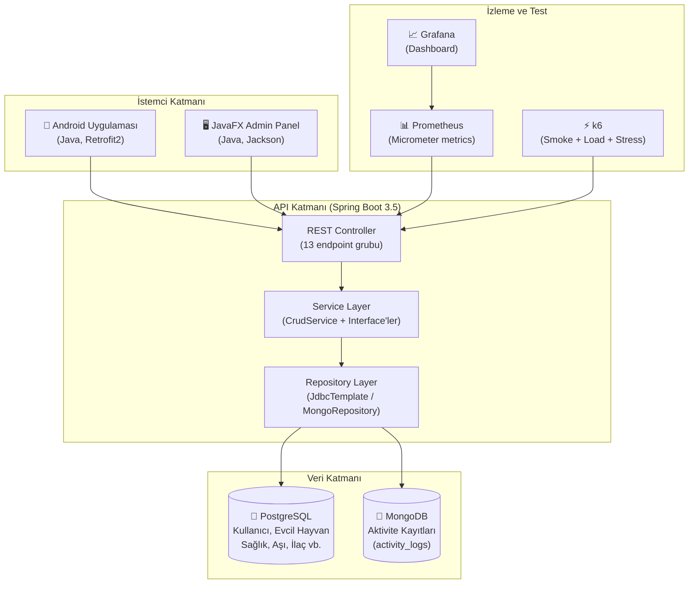
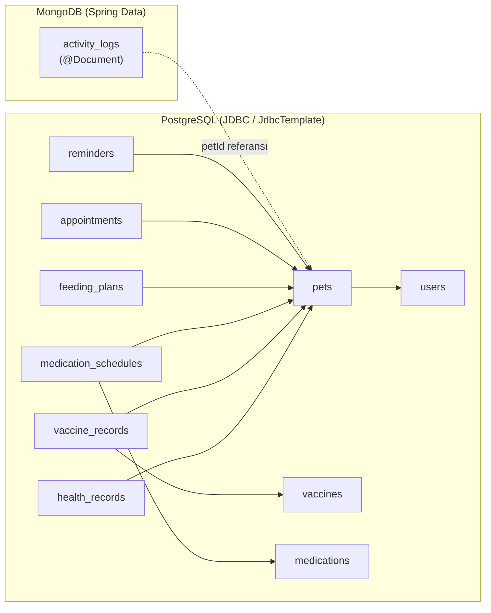
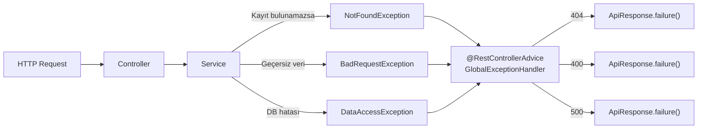
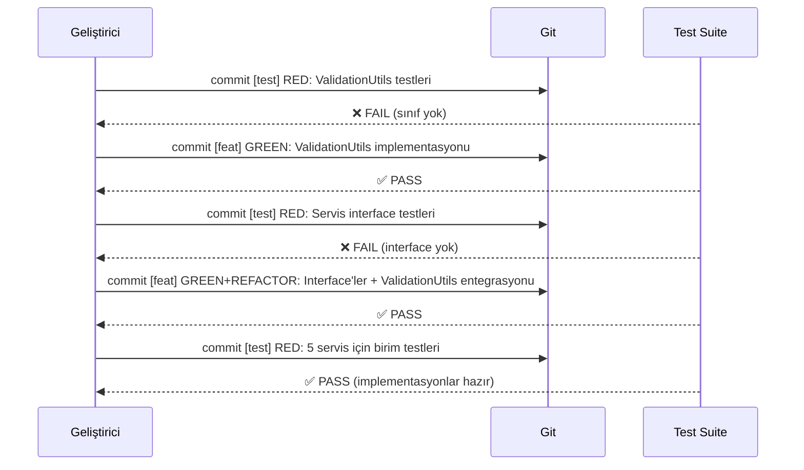
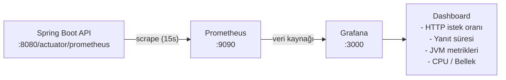

# PetCare-Tracer — Teknik Rapor

> **Proje:** PetCare-Tracer | **Kurs:** TBL324 İleri Java Uygulamaları  
> **Teknoloji Yığını:** Java 17 · Spring Boot 3.5 · PostgreSQL · MongoDB · JavaFX · Android · Docker

---

## 1. Sistem Mimarisi



---

## 2. Katmanlı Mimari ve SOLID Prensipleri

### 2.1 Paket Yapısı

```
com.petcarebackend
├── controller/          ← Presentation Layer (13 sınıf)
├── service/             ← Business Logic Layer
│   ├── CrudService.java         ← Generic<Res, ID, Req> arayüzü
│   ├── IPetService.java         ← DIP: PetService sözleşmesi
│   ├── IUserService.java
│   ├── IAppointmentService.java
│   ├── IReminderService.java
│   ├── IVaccineService.java
│   ├── PetService.java          ← implements IPetService
│   └── ...
├── repository/          ← Data Access Layer (JDBC + MongoDB)
├── model/               ← Domain Model (Java Records)
├── dto/                 ← Data Transfer Objects (Java Records)
├── exception/           ← Hata Hiyerarşisi
├── config/              ← Spring Konfigürasyonu
└── util/
    └── ValidationUtils.java     ← DRY: Ortak validasyon metotları
```

### 2.2 Uygulanan SOLID Prensipleri

| Prensip | Uygulama |
|---------|----------|
| **S** — Single Responsibility | Her servis tek bir varlık yönetiyor (`PetService`, `UserService`...) |
| **O** — Open/Closed | `CrudService<T>` arayüzü genişletilebilir; mevcut kod değiştirilmeden yeni servisler eklenebilir |
| **L** — Liskov Substitution | `PetService implements IPetService` — arayüz yerine implementasyon kullanılabilir |
| **I** — Interface Segregation | `CrudService` genel CRUD sağlar; domain-spesifik arayüzler (`IPetService`) ek metotlar ekler |
| **D** — Dependency Inversion | Controller'lar somut sınıfa değil `IPetService`, `IUserService` arayüzlerine bağlanabilir |

---

## 3. Generic Yapılar

### 3.1 CrudService\<Res, ID, Req\>

```java
public interface CrudService<Res, ID, CreateReq> {
    List<Res> findAll();
    Res findById(ID id);
    Res create(CreateReq request);
    void delete(ID id);
}
```

### 3.2 ApiResponse\<T\>

```java
public record ApiResponse<T>(boolean success, String message, T data) {
    public static <T> ApiResponse<T> success(T data) { ... }
    public static <T> ApiResponse<T> failure(String message) { ... }
}
```

### 3.3 StatusBadgeCell\<T\> (JavaFX)

```java
public class StatusBadgeCell<T> extends TableCell<T, String> {
    // Canvas + GraphicsContext ile özel durum badge'i
}
```

---

## 4. Veri Katmanı — JDBC & NoSQL



**Seçim gerekçesi:**
- **PostgreSQL + JDBC:** İlişkisel yapı, FK bütünlüğü, ACID garantisi
- **MongoDB:** Aktivite logları şemasız/esnek yapı gerektirir; sık yazma, zaman serisi

---

## 5. Hata Yönetimi



---

## 6. Performans Testleri

### 6.1 Smoke Test (smoke-test.js)
Sistemin ayakta ve temel yanıt verdiğini doğrular.

| Parametre | Değer |
|-----------|-------|
| VU | 1 |
| Süre | 30 saniye |
| Beklenti | %100 başarı, p95 < 1000ms |

### 6.2 Yük Testi (core-load.js)
Orta düzey yük altında performansı ölçer.

| Aşama | VU | Süre |
|-------|-----|------|
| Isınma | 5 | 20s |
| Yük | 15 | 40s |
| Soğuma | 0 | 20s |

**Eşikler:** hata < %2, p95 < 2000ms

### 6.3 Stres / Kırılma Testi (stress-test.js)
Sistemin kırılma noktasını bulur.

| Aşama | VU | Süre |
|-------|-----|------|
| Isınma | 10 | 30s |
| Normal | 25 | 30s |
| Yoğun | 50 | 30s |
| Stres | 100 | 30s |
| Kırılma | 150 | 30s |
| Soğuma | 0 | 30s |

**Eşikler:** hata < %10, p95 < 3000ms

### 6.4 Test Çalıştırma Komutları

```bash
# Yerel
k6 run tests/k6/smoke-test.js
k6 run tests/k6/core-load.js
k6 run tests/k6/stress-test.js

# Docker ile
docker compose --profile loadtest run --rm k6 run /scripts/smoke-test.js
docker compose --profile loadtest run --rm k6 run /scripts/core-load.js
docker compose --profile loadtest run --rm k6 run /scripts/stress-test.js
```

---

## 7. TDD — Test Kapsamı

### 7.1 Test Sınıfları (commit tarih sırası: RED → GREEN)

| Sınıf | Commit | Test Sayısı |
|-------|--------|-------------|
| `ValidationUtilsTest` | RED commit | 6 |
| `AuthServiceTest` | RED commit | 2 |
| `ActivityLogServiceTest` | RED commit | 2 |
| `FeedingPlanServiceTest` | RED commit | 2 |
| `PetServiceTest` | RED commit | 9 |
| `UserServiceTest` | RED commit | 7 |
| `AppointmentServiceTest` | RED commit | 7 |
| `VaccineServiceTest` | RED commit | 7 |
| `ReminderServiceTest` | RED commit | 9 |
| **TOPLAM** | | **51 test** |

### 7.2 Red-Green-Refactor Döngüsü



---

## 8. Gözlemlenebilirlik (Observability)



**Açık endpointler:**
- `GET /actuator/health` — sağlık kontrolü
- `GET /actuator/prometheus` — Prometheus metrikleri
- `GET /actuator/metrics` — tüm metrikler

---

## 9. Docker Compose Servisleri

| Servis | Image | Port | Açıklama |
|--------|-------|------|----------|
| `postgres` | postgres:17 | 5433 | İlişkisel DB (healthcheck'li) |
| `mongo` | mongo:8 | 27018 | Doküman DB (healthcheck'li) |
| `backend` | build | 8080 | Spring Boot API |
| `prometheus` | prom/prometheus | 9090 | Metrik toplama |
| `grafana` | grafana/grafana | 3000 | Görselleştirme |
| `k6` | grafana/k6 | — | Yük testi (loadtest profili) |

```bash
# Tüm sistemi başlat
docker compose up --build

# Yük testini çalıştır
docker compose --profile loadtest run --rm k6 run /scripts/stress-test.js
```
