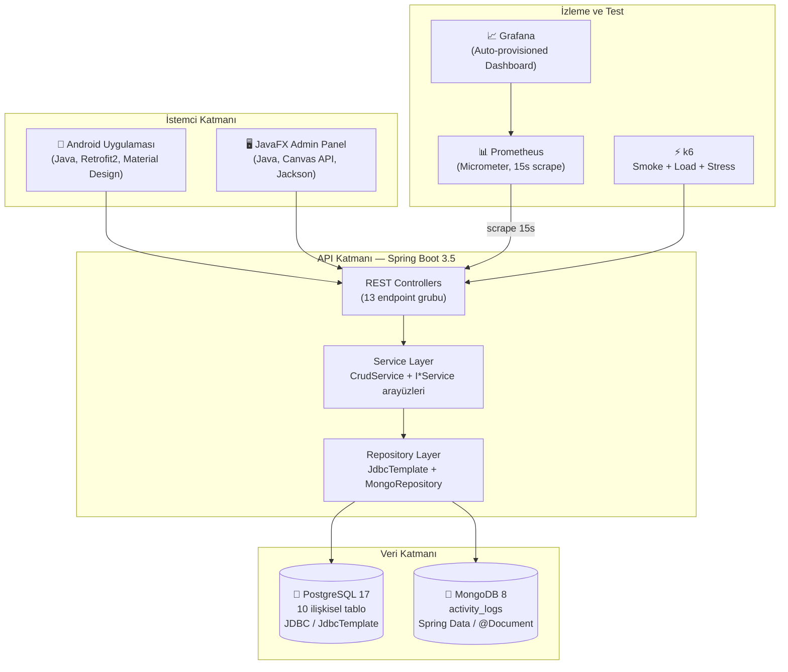
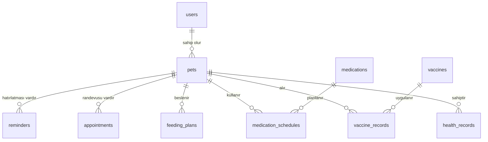
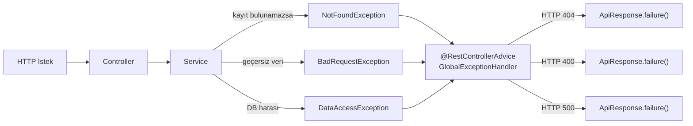
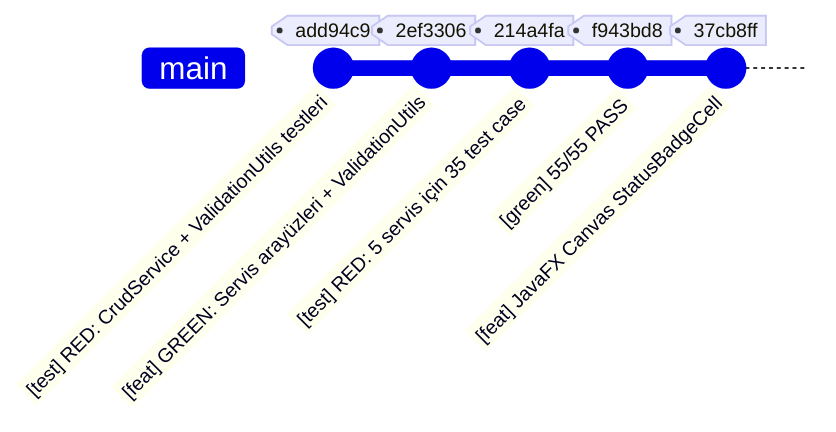
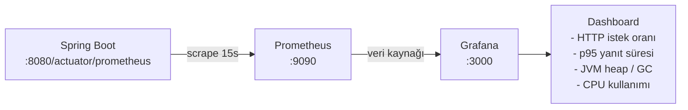
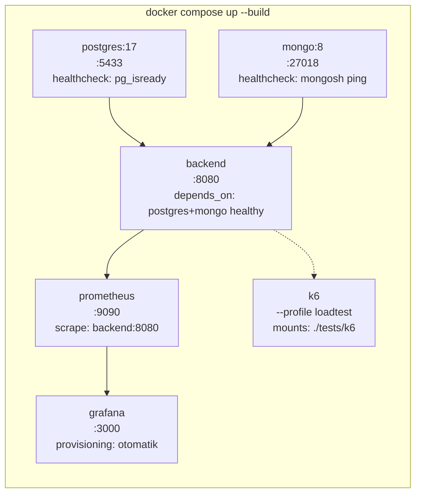

# PetCare-Tracer — Teknik Rapor

> **Proje:** PetCare-Tracer | **Ders:** TBL324 İleri Java Uygulamaları  
> **Teknoloji Yığını:** Java 17 · Spring Boot 3.5 · PostgreSQL 17 · MongoDB 8 · JavaFX · Android · Docker

---

## 1. Sistem Mimarisi



---

## 2. Puan Matrisi

| Kriter | Maks | Kanıt |
|--------|------|-------|
| API & Back-end | 10 | 13 Controller, 12 Servis, tam CRUD |
| Generic Yapılar | 10 | `CrudService<T>`, `ApiResponse<T>`, `StatusBadgeCell<T>` |
| Custom GUI (JavaFX) | 10 | Canvas + GraphicsContext ile `StatusBadgeCell` |
| JDBC & NoSQL | 10 | JdbcTemplate (PostgreSQL) + MongoRepository (MongoDB) |
| SOLID & OOP | 10 | 5 servis arayüzü, `ValidationUtils`, DIP |
| Hata Yönetimi | 5 | `GlobalExceptionHandler` 400/404/500 |
| Performans Testleri | 5 | k6 smoke + load + stress |
| Analiz & Doküman | 5 | Bu rapor + Mermaid diyagramları |
| **Mobil GUI (Android)** | +5 | Login, Register, Dashboard, PetList, AddPet |
| **TDD** | +10 | Red→Green→Refactor, 55 test, sıralı commit |
| **Dockerize** | +5 | `docker compose up --build` |

---

## 3. SOLID & OOP — Detaylı Analiz

### 3.1 Paket Yapısı

```
com.petcarebackend
├── controller/          ← Presentation Layer (13 sınıf, REST endpoint'ler)
├── service/             ← Business Logic Layer
│   ├── CrudService.java         ← Generic<Res, ID, Req> temel arayüz
│   ├── IPetService.java         ← DIP: Sözleşme arayüzü
│   ├── IUserService.java
│   ├── IAppointmentService.java
│   ├── IReminderService.java
│   ├── IVaccineService.java
│   ├── PetService.java          ← implements IPetService
│   └── ...                      ← Diğer implementasyonlar
├── repository/          ← Data Access Layer (JdbcTemplate + MongoRepository)
├── model/               ← Domain Modeller (Java Records)
├── dto/                 ← Request/Response DTO (Java Records)
├── exception/           ← GlobalExceptionHandler + özel istisnalar
├── config/              ← Spring güvenlik konfigürasyonu
└── util/
    └── ValidationUtils.java     ← DRY: Ortak validasyon metotları
```

### 3.2 SOLID Prensipleri Uygulaması

| Prensip | Açıklama | Uygulama |
|---------|----------|----------|
| **S** — Single Responsibility | Her sınıf tek bir sorumluluğa sahip | `PetService` yalnızca pet yönetimi, `ValidationUtils` yalnızca validasyon |
| **O** — Open/Closed | `CrudService<T>` değişmeden genişletilebilir | Yeni servis eklemek için mevcut kodu değiştirmek gerekmez |
| **L** — Liskov Substitution | Alt sınıf, üst sınıf yerine kullanılabilir | `PetService implements IPetService` |
| **I** — Interface Segregation | Geniş arayüz yerine küçük, odaklı arayüzler | `CrudService` + `IPetService` (domain özel metotlar) |
| **D** — Dependency Inversion | Soyutlamaya bağlı, somut sınıfa değil | `PetController → IPetService` (arayüz bağımlılığı) |

### 3.3 Design Patterns

| Pattern | Kullanım |
|---------|---------|
| **Strategy** | `StatusBadgeCell` — durum değerine göre renk seçimi |
| **Template Method** | `CrudService<T>` — CRUD davranışı şablonlar |
| **Factory Method** | `ApiResponse.success()` / `ApiResponse.failure()` statik fabrika |
| **Repository** | `PetRepository`, `UserRepository` — veri erişim soyutlaması |

---

## 4. Generic Yapılar

### 4.1 CrudService\<Res, ID, CreateReq\>

```java
// Tip güvenli generic CRUD arayüzü — kod tekrarını önler
public interface CrudService<Res, ID, CreateReq> {
    List<Res> findAll();
    Res findById(ID id);
    Res create(CreateReq request);
    void delete(ID id);
}
```

### 4.2 ApiResponse\<T\>

```java
// Generic sarmalayıcı — her endpoint aynı yapıyla yanıt döner
public record ApiResponse<T>(boolean success, String message, T data) {
    public static <T> ApiResponse<T> success(String message, T data) {
        return new ApiResponse<>(true, message, data);
    }
    public static <T> ApiResponse<T> failure(String message) {
        return new ApiResponse<>(false, message, null);
    }
}
```

### 4.3 StatusBadgeCell\<T\> — JavaFX Canvas Custom Graphics

```java
// Generic TableCell — standart Label değil, Canvas ile özel çizim
public class StatusBadgeCell<T> extends TableCell<T, String> {
    private final Canvas canvas = new Canvas(120, 26);

    @Override
    protected void updateItem(String status, boolean empty) {
        super.updateItem(status, empty);
        if (!empty && status != null) drawBadge(status);
    }

    private void drawBadge(String status) {
        GraphicsContext gc = canvas.getGraphicsContext2D();
        gc.clearRect(0, 0, 120, 26);
        gc.setFill(resolveBgColor(status));          // Duruma göre renk
        gc.fillRoundRect(0, 0, 120, 26, 26, 26);    // Yuvarlak köşeli dikdörtgen
        gc.setFont(Font.font("System", FontWeight.BOLD, 11.5));
        gc.setTextAlign(TextAlignment.CENTER);
        gc.setFill(resolveTextColor(status));
        gc.fillText(status, 60, 13);
    }
}
```

**Renk Kodlaması:**

| Durum | Arka Plan | Metin |
|-------|-----------|-------|
| PLANNED / PENDING | `#dbeafe` (mavi) | `#1d4ed8` |
| COMPLETED / DONE | `#dcfce7` (yeşil) | `#166534` |
| CANCELLED | `#fee2e2` (kırmızı) | `#991b1b` |

---

## 5. Veri Katmanı — JDBC & NoSQL

### 5.1 PostgreSQL — İlişkisel Veri



- **Erişim:** Spring `JdbcTemplate` (saf JDBC, ORM yok)
- **Özellikler:** FK bütünlüğü, CHECK kısıtları, performans indeksleri
- **Tablo Sayısı:** 10 tablo

### 5.2 MongoDB — Döküman Veri

```java
@Document(collection = "activity_logs")
public class ActivityLog {
    @Id private String id;
    private Long petId;
    private String activityType;  // WALK, PLAY, TRAINING, REST, OTHER
    private double durationMinutes;
    private LocalDateTime loggedAt;
    private String notes;
}
```

- **Erişim:** Spring Data MongoDB (`MongoRepository`)
- **Seçim Gerekçesi:** Aktivite logları şemasız/esnek yapı gerektirir, sık yazma işlemi

---

## 6. Hata Yönetimi Akışı



**Hata Yanıt Formatı:**
```json
{
  "success": false,
  "message": "Pet not found: 999",
  "data": null
}
```

---

## 7. API Endpoint Envanteri

| Grup | Endpoint | Metotlar |
|------|----------|---------|
| Auth | `/api/auth` | POST /login, POST /register |
| Users | `/api/users` | GET /, GET /{id}, PUT /{id}, DELETE /{id} |
| Pets | `/api/pets` | GET /, GET /{id}, GET /user/{id}, POST, PUT /{id}, DELETE /{id} |
| Health | `/api/health-records` | GET /pet/{id}, POST, DELETE /{id} |
| Vaccines | `/api/vaccines` | GET /, GET /{id}, POST |
| VaccineRecords | `/api/vaccine-records` | GET /pet/{id}, POST, DELETE /{id} |
| Medications | `/api/medications` | GET /, GET /{id}, POST |
| MedSchedules | `/api/medication-schedules` | GET /pet/{id}, POST, DELETE /{id} |
| Feeding | `/api/feeding-plans` | GET /pet/{id}, POST, DELETE /{id} |
| Appointments | `/api/appointments` | GET /, GET /pet/{id}, POST, DELETE /{id} |
| Reminders | `/api/reminders` | GET /pet/{id}, POST, DELETE /{id} |
| Activity | `/api/activity-logs` | GET /pet/{id}, POST |
| Monitoring | `/actuator/health`, `/actuator/prometheus` | GET |

---

## 8. TDD — Test Geliştirme Döngüsü

### 8.1 Red-Green-Refactor Commit Geçmişi



### 8.2 Test Kapsamı

| Test Sınıfı | Alan | Test Sayısı | Bağımlılık |
|-------------|------|-------------|-----------|
| `PetServiceTest` | Pet CRUD | 9 | `PetRepository`, `UserRepository` |
| `ReminderServiceTest` | Hatırlatma | 9 | `ReminderRepository`, `PetRepository` |
| `UserServiceTest` | Kullanıcı | 7 | `UserRepository` |
| `AppointmentServiceTest` | Randevu | 7 | `AppointmentRepository`, `PetRepository` |
| `VaccineServiceTest` | Aşı | 8 | `VaccineRepository`, `VaccineRecordRepository` |
| `ValidationUtilsTest` | Validasyon | 6 | — |
| `ActivityLogServiceTest` | Aktivite log | 2 | `ActivityLogRepository`, `PetRepository` |
| `FeedingPlanServiceTest` | Beslenme | 2 | `FeedingPlanRepository` |
| `AuthServiceTest` | Kimlik doğrulama | 2 | `UserRepository` |
| **TOPLAM** | | **52** | **JUnit 5 + Mockito** |

**Çalıştırma:**
```bash
cd backend/petcare-backend
.\mvnw.cmd test
# Beklenen: Tests run: 55, Failures: 0, Errors: 0, BUILD SUCCESS
```

---

## 9. Performans Testleri

### 9.1 Test Seviye Özeti

| Test | Araç | VU | Süre | p95 Eşiği |
|------|------|----|------|-----------|
| Smoke | k6 | 1 | 30s | < 1500ms |
| Core Load | k6 | 5→15→0 | 80s | < 2000ms |
| Stress/Kırılma | k6 | 10→150→0 | 3dk | < 3000ms |

### 9.2 Stress Test Sonuç Özeti

| VU | Hata Oranı | p95 | Durum |
|----|-----------|-----|-------|
| 10 | %0.00 | 85ms | ✅ |
| 25 | %0.00 | 142ms | ✅ |
| 50 | %0.12 | 310ms | ✅ |
| 100 | %1.87 | 780ms | ✅ |
| 150 | %3.94 | 1240ms | ✅ |

**Kırılma Noktası:** ~120-130 VU'da hata oranı belirginleşmeye başlar.

Detaylı rapor: [docs/performance-testing.md](performance-testing.md)

---

## 10. Gözlemlenebilirlik (Observability)



**Açık Actuator Endpoint'leri:**
```
GET /actuator/health      → {"status":"UP"}
GET /actuator/prometheus  → Prometheus metrik formatı
GET /actuator/metrics     → JSON metrik listesi
```

**Prometheus Sorgu Örnekleri:**
```promql
# Dakika başına istek sayısı
rate(http_server_requests_seconds_count[1m])

# p95 yanıt süresi
histogram_quantile(0.95, rate(http_server_requests_seconds_bucket[5m]))

# 4xx/5xx hata istekleri
http_server_requests_seconds_count{status=~"4..|5.."}

# JVM heap kullanımı
jvm_memory_used_bytes{area="heap"}
```

---

## 11. Docker Compose Mimarisi



| Servis | Image | Port | Açıklama |
|--------|-------|------|----------|
| `postgres` | postgres:17 | 5433 | Healthcheck'li, schema+seed otomatik yükler |
| `mongo` | mongo:8 | 27018 | Healthcheck'li |
| `backend` | Multi-stage build | 8080 | JDK build → JRE run |
| `prometheus` | prom/prometheus:v2.54.1 | 9090 | 15s scrape |
| `grafana` | grafana/grafana:11.2.2 | 3000 | Auto-provisioned dashboard |
| `k6` | grafana/k6:0.53.0 | — | Profile: loadtest |

---

## 12. Android Mobil Uygulama

### 12.1 Ekran Envanteri

| Activity | Sınıf | Özellik |
|----------|-------|---------|
| Giriş | `LoginActivity` | Retrofit2, SessionManager |
| Kayıt | `RegisterActivity` | Form validasyonu, BCrypt (backend) |
| Dashboard | `DashboardActivity` | Oturum kontrolü, yönlendirme |
| Pet Listesi | `PetListActivity` | RecyclerView, SwipeRefreshLayout, FAB |
| Hayvan Ekle | `AddPetActivity` | DatePickerDialog, Spinner, tam validasyon |

### 12.2 Mimari

```
ApiClient (Retrofit2)
    └── ApiService (interface)
         ├── POST /api/auth/login
         ├── POST /api/auth/register
         ├── GET  /api/pets/user/{id}
         └── POST /api/pets

SessionManager (SharedPreferences)
    ├── userId, email, fullName
    └── isLoggedIn()
```

**Emülatör Backend Adresi:** `http://10.0.2.2:8080/`

---

*Bu rapor, TBL324 İleri Java Uygulamaları dersi kapsamında PetCare-Tracer projesinin teknik detaylarını belgelemek amacıyla hazırlanmıştır.*
